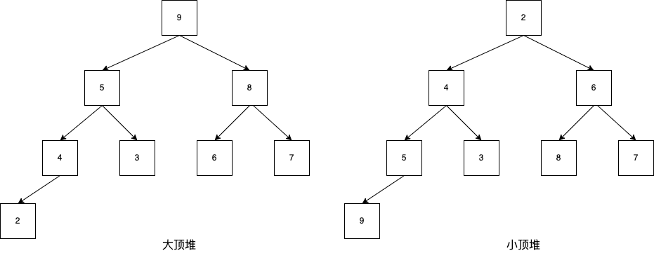
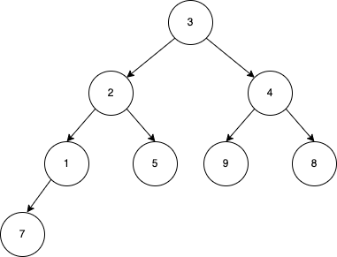
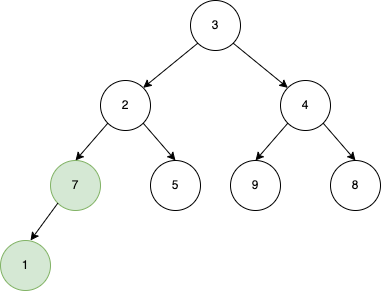
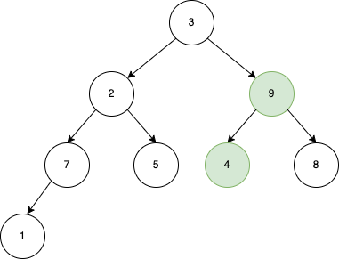
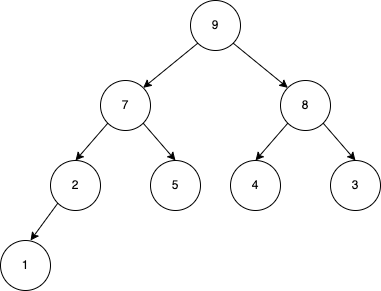
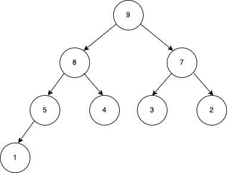

# 首先了解堆是什么
堆是一种数据结构，一种叫做完全二叉树的数据结构。
## 堆的种类
- 大顶堆：每个节点的值都大于或者等于它的左右子节点的值。
- 小顶堆：每个节点的值都小于或者等于它的左右子节点的值。
### 图示

## 映射到数组
- 大顶堆 - [9,5,8,4,3,6,7,2]
- 小顶堆 - [2,4,6,5,3,8,7,9]

从图示中可以看出堆的一个重要特征 
大顶堆-arr[i] >= arr[2 * i + 1] && arr[2 * i + 2];  
小顶堆-arr[i] <= arr[2 * i + 1] && arr[2 * i + 2];  
arr[2 * i + 1],arr[2 * i + 2] 分别是 arr[i]的左、右孩子。 
# 堆排序思想
1. 将待排序的数组构造成一个大顶堆，大顶堆的特点-堆的根节点就是数组中的最大元素；
2. 将堆顶元素交换至数组尾部；
3. 重复前两个步骤-对剩下的节点递归构造大顶堆，这样就可以完成数组的排序了；
## 示例
将一个无序序列 array - [3,2,4,1,5,9,8,7]构建成一个大顶堆。
### 思路
1. 根据大顶堆的性质，每个节点的值都大于或者等于它的左右子节点的值。所以我们需要找到所有包含子节点的节点，也就是非叶子节点；
2. 调整父子关系-<strong>非叶子节点遍历的顺序应该是从下往上</strong>,这比从上往下的顺序遍历次数少很多; 
   - 大顶堆的性质要求父节点的值要大于或者等于子节点的值，如果从上往下遍历，当某个节点即是父节点又是子节点并且它的子节点仍然有子节点的时候，因为子节点还没有遍历到，所以子节点不符合大顶堆性质，当子节点调整后，必然会影响其父节点需要二次调整;
   - 但是从下往上的方式不需要考虑父节点，因为当前节点调整完之后，当前节点必然比它的所有子节点都大，所以，只会影响到子节点二次调整;
   - 相比之下，从下往上的遍历方式比从上往下的方式少了父节点的二次调整。
3. 确定最后一个非叶子节点的位置 
   非叶子节点的索引就是arr.length / 2 -1。  
   对于一个完全二叉树，在填满的情况下（非叶子节点都有两个子节点），每一层的元素个数是上一层的二倍，根节点数量是1，所以最后一层的节点数量，一定是之前所有层节点总数+1，所以，我们能找到最后一层的第一个节点的索引，即节点总数/2（根节点索引为0），这也就是第一个叶子节点，所以第一个非叶子节点的索引就是第一个叶子结点的索引-1。那么对于填不满的二叉树呢？这个计算方式仍然适用，当我们从上往下，从左往右填充二叉树的过程中，第一个叶子节点，一定是序列长度/2，所以第一个非叶子节点的索引就是arr.length / 2 -1。
### 演示过程
0. 第一个堆顶元素-初始状态

1. 找到最后一个编号-3 = arr.length / 2 -1；对应元素arr[3] -> 7

2. 继续寻找编号-2 = arr[2] = 4

3. 第一个堆顶元素-省略中间过程

- array 第一个、最后一个元素交换位置，移除最后一个元素，接下来对数组里剩余的元素继续构建大碓顶操作
4. 省略中间过程，最终状态

# 代码实现
java 代码实现见 `com.aboruo.algorithm.sort.heapSort.HeapSort`